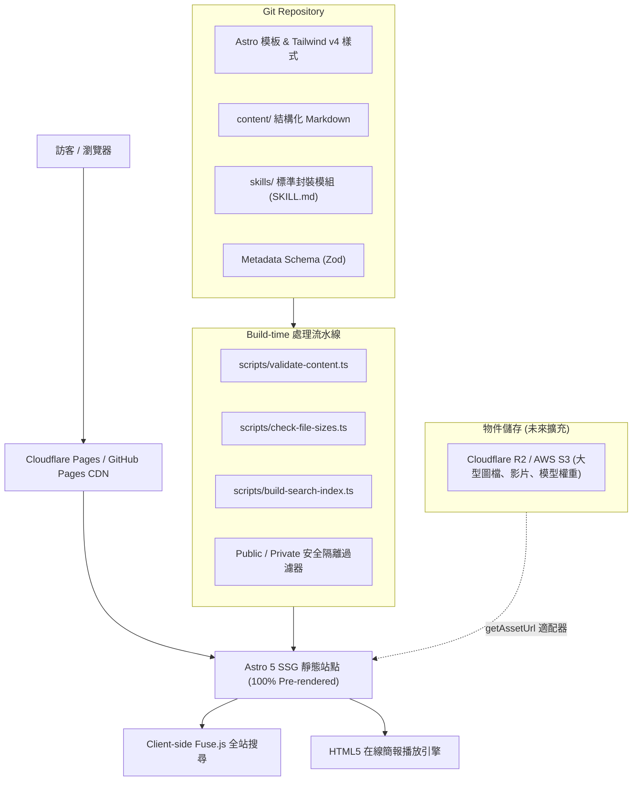

# Charles AI Workspace 架構設計說明書 (Architecture Design)

## 1. 專案願景與定位
Charles AI Workspace 是個人長期使用的 AI 工作與知識資產管理中心。專案核心理念為 **Static-First、Metadata-Driven、Zero-Server Overhead**。

---

## 2. 核心架構決策 (Architecture Decisions)

### 2.1 靜態優先 (Static-First)
- **選型**：採用 **Astro 5 + Tailwind CSS v4**。
- **優勢**：
  1. 編譯為純靜態 HTML/CSS/JS，頁面可在全球 CDN 邊緣節點極速分發（載入時間 < 100ms）。
  2. 零伺服器維護成本，免除 VPS、容器或 MySQL 關聯式資料庫維護。
  3. 絕佳的安全性，天然阻絕 SQL Injection 與未授權遠端代碼執行。

### 2.2 Metadata Schema 驅動
- 所有內容透過 [src/lib/schema.ts](file:///c:/Users/Charles/Documents/CharlesAIWorkspace/src/lib/schema.ts) 的 **Zod Schema** 進行強型別校驗。
- 支援平滑過渡：未來若升級至 Cloudflare D1 或 Supabase，欄位結構與驗證邏輯可 100% 無縫繼承。

### 2.3 Build-time 隱私安全隔離 (Privacy Isolation)
- **原則**：前端 CSS 隱藏並非真正的隱私保護。
- **實作**：在 [src/lib/content.ts](file:///c:/Users/Charles/Documents/CharlesAIWorkspace/src/lib/content.ts) 中，於靜態生成階段徹底過濾 `visibility === 'private'` 之條目。
- 私有項目絕不會被打包至公開的 HTML、`search-index.json` 或 Sitemap。

### 2.4 資產與大型檔案儲存策略
- **Git Repository 限制**：僅收錄代碼、Markdown、Metadata 與微型預覽圖，單檔超過 10MB 將直接在 CI 阻斷（超過 5MB 發出警告）。
- **Asset URL 抽象適配器**：透過 [src/lib/assets.ts](file:///c:/Users/Charles/Documents/CharlesAIWorkspace/src/lib/assets.ts) 的 `getAssetUrl` 封裝，未來配置 `PUBLIC_CDN_BASE_URL` 即可無縫切換為 Cloudflare R2 或 AWS S3。

---

## 3. 搜尋策略
- **v1.0**：採用建置期生成 `search-index.json` + 前端 `Fuse.js` 模糊檢索。
- **未來遷移**：保留 Search Provider 介面，當資料量突破數千筆時，可直接替換為 Pagefind 或伺服器端向量語意搜尋。
